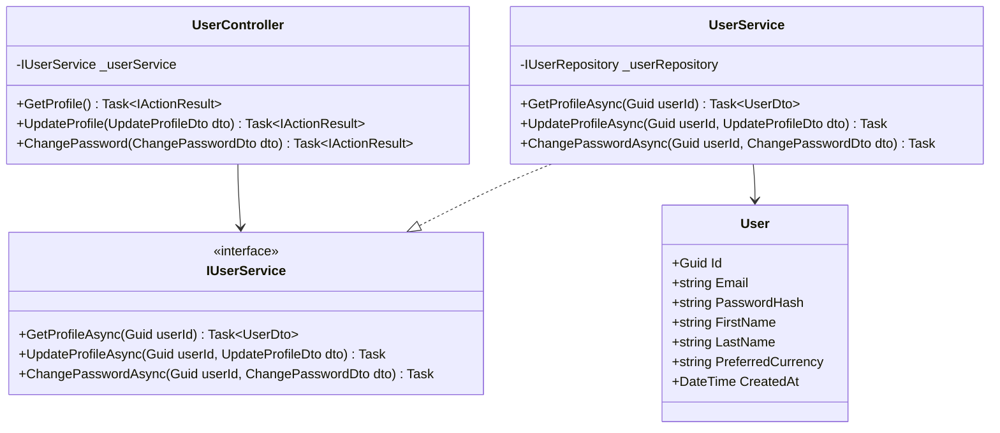
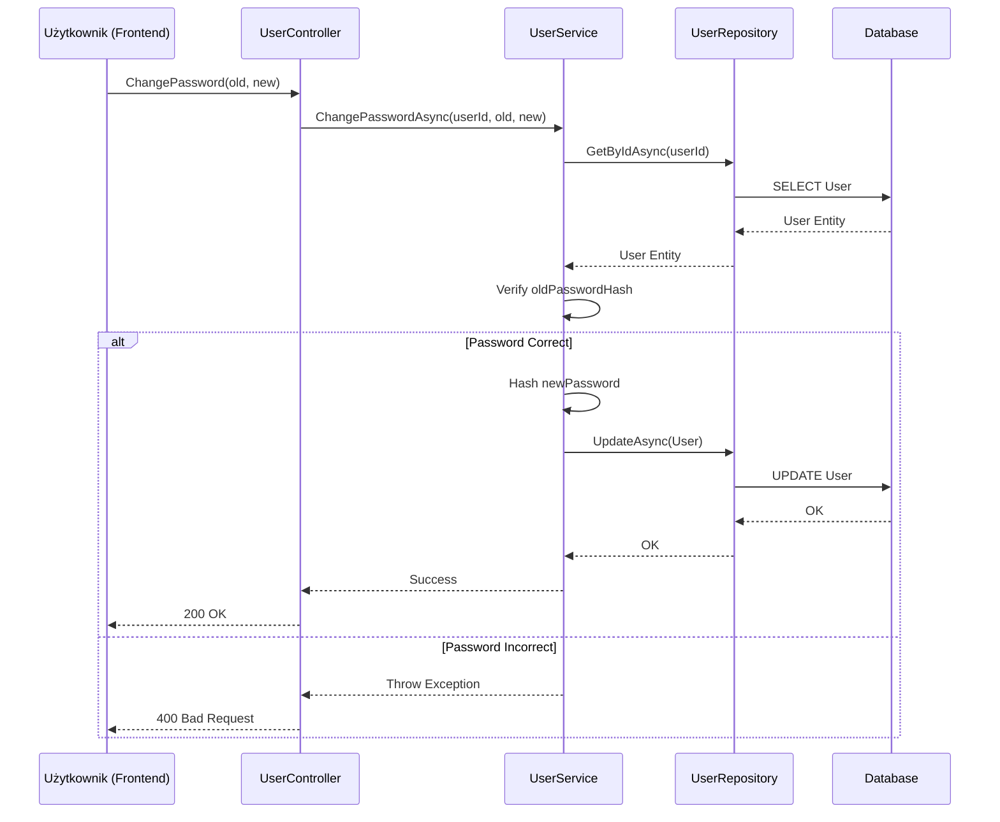

# Dokumentacja Funkcjonalności: Zarządzanie Profilem i Bezpieczeństwem

## 1. Opis Funkcjonalności
Funkcjonalność pozwala użytkownikowi na:
- Przeglądanie swoich danych podstawowych (Email, Data utworzenia konta).
- Aktualizację imienia i nazwiska.
- Bezpieczną zmianę hasła (wymagane podanie starego hasła).
- Wybór preferowanej waluty (USD/EUR) zapisywany w bazie danych/profilu.

## 2. Diagramy

### Diagram Klas (Backend)


### Diagram Sekwencji: Zmiana Hasła


## 3. Instrukcja Testowania

### Testy Jednostkowe (Backend)
Uruchom testy w terminalu:
```bash
dotnet test Serwer/Serwer.sln
```
Zwróć szczególną uwagę na `UserServiceTests.cs`.

### Testy Manualne (Frontend + Backend)
1. **Logowanie/Rejestracja:**
   - Zarejestruj nowe konto lub zaloguj się na istniejące.
   - Po zalogowaniu powinieneś zostać przekierowany na `/dashboard`.
   - Spróbuj wejść na `/login` będąc zalogowanym - powinieneś zostać automatycznie cofnięty do dashboardu.
2. **Ustawienia Profilu:**
   - Przejdź do zakładki **Settings** (klikając w profil w sidebarze).
   - Wypełnij Imię i Nazwisko, a następnie kliknij **Save Profile**.
   - Odśwież stronę - Twoje imię powinno pojawić się w sidebarze nad adresem email.
3. **Zmiana Hasła:**
   - W sekcji **Security** wpisz stare hasło oraz nowe hasło (min. 8 znaków).
   - Kliknij **Update Password**. Powinien pojawić się komunikat o sukcesie.
   - Wyloguj się i spróbuj zalogować nowym hasłem.
4. **Preferencje Waluty:**
   - Zmień walutę na EUR i kliknij **Save Preferences**.
   - Waluta powinna zostać zapisana w Twoim profilu (można sprawdzić w bazie lub odświeżając stronę).

